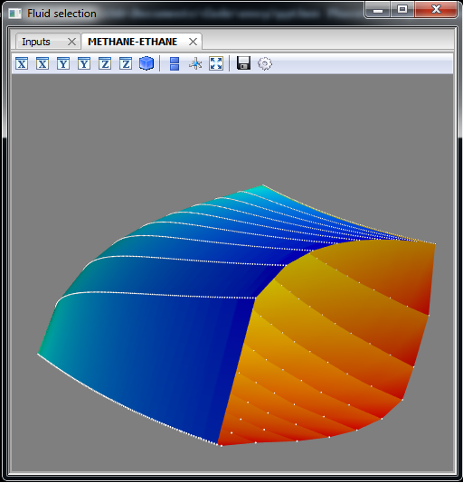

Envy
----

Written by Ian H. Bell, Ph.D., National Institute of Standards and Technology, 2015

Information
-----------
This program is written to allow users to visualize in 3D phase envelopes of binary mixtures.  It uses either REFPROP (recommended) (http://www.nist.gov/srd/nist23.cfm) or CoolProp (www.coolprop.org) to generate the phase envelopes for a range of compositions, and then displays the data in 3D using Mayavi (http://docs.enthought.com/mayavi/mayavi/index.html).

At the low level, CoolProp is used to do data input and output, and it can delegate to REFPROP if REFPROP is installed, otherwise the CoolProp routines can be used by selecting the HEOS backend if REPROP is not available.

Requirements
------------
There are a few requirements for this software that must be met:

- python 2.7 (NOT compatible with 3.x due to wxpython version limitations)
- wxpython (MUST be 2.8, NOT compatible with 3.0 (classic or phoenix), download an installer from http://sourceforge.net/projects/wxpython/files/wxPython/2.8.12.1/)
- mayavi and its dependencies (``conda`` install)
- numpy (``conda`` install)
- CoolProp (``pip`` install, see www.coolprop.org)
- cx_Freeze (for packaging script into executable)

Optionally, though it is highly recommended, you can use REFPROP to generate the phase envelopes.  The algorithms in REFPROP are far faster and more reliable at this point.

It is recommended (but not required) that you use Anaconda to create an environment into which you install mayavi and its dependencies.

Use
---
At the command prompt:

``python envy.py``

Packaging
---------
At the command prompt:

``python setup.py build``

Find the output in the ``build`` directory

License
-------
Public-domain - see LICENSE.txt

Screenshot
----------
N.B. - might not always be up to date

